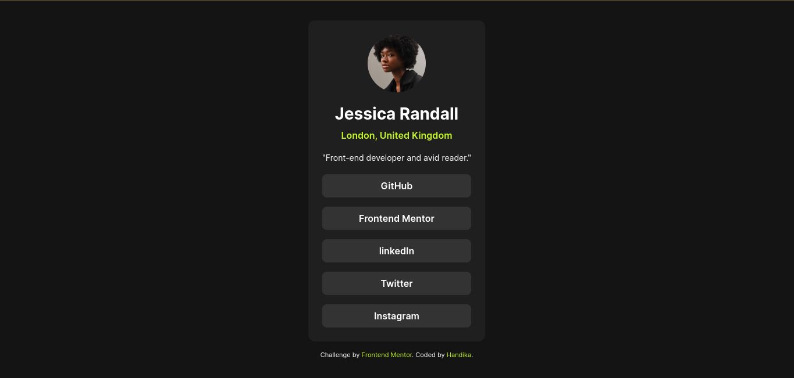

# Frontend Mentor - Social links profile solution

This is a solution to the [Social links profile challenge on Frontend Mentor](https://www.frontendmentor.io/challenges/social-links-profile-UG32l9m6dQ). Frontend Mentor challenges help you improve your coding skills by building realistic projects. 

## Table of contents

- [Overview](#overview)
  - [The challenge](#the-challenge)
  - [Screenshot](#screenshot)
  - [Links](#links)
- [My process](#my-process)
  - [Built with](#built-with)
  - [What I learned](#what-i-learned)             
  - [Useful resources](#useful-resources)
- [Author](#author)

## Overview

### The challenge

Users should be able to:

- See hover and focus states for all interactive elements on the page

### Screenshot



### Links

- Solution URL: [Add solution URL here](https://your-solution-url.com)
- Live Site URL: [Add live site URL here](https://your-live-site-url.com)

## My process

### Built with

- Semantic HTML5 markup
- CSS custom properties
- Flexbox

### What I learned

Centering element with Flexbox


```css
body {
  display: flex;
  justify-content: center;
  align-items: center;
}
```

### Useful resources

- [W3schools](https://www.w3schools.com/css/css3_flexbox.asp) - This helped me for learn Flexbox easley

## Author

- Frontend Mentor - [@kun026](https://www.frontendmentor.io/profile/kun026)
- Twitter - [@han_dicca](https://www.twitter.com/han_dicca)

